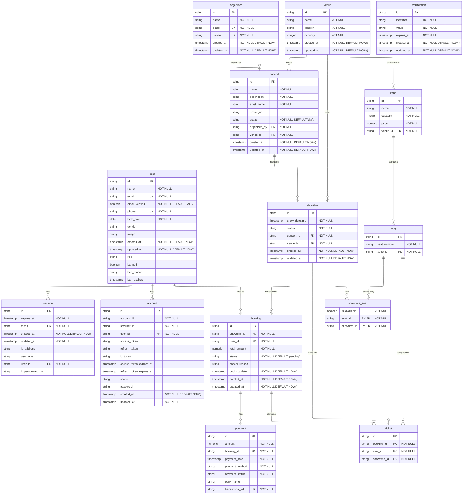

# Entity Relationship Diagram (ERD)

This diagram represents the database schema for the project, using [Mermaid](https://mermaid.js.org/) syntax.

```mermaid
---
id: 54dc9707-104b-480b-a432-f94e7af92579
config:
  layout: elk
---
erDiagram
    %% Auth Schema
    user ||--o{ session : "has"
    user ||--o{ account : "has"
    user ||--o{ booking : "makes"
    
    %% Ticket Schema
    organizer ||--o{ concert : "organizes"
    venue ||--o{ concert : "hosts"
    venue ||--o{ zone : "divided into"
    venue ||--o{ showtime : "hosts"
    concert ||--o{ showtime : "includes"
    zone ||--o{ seat : "contains"
    
    seat ||--o{ showtime_seat : "availability"
    showtime ||--o{ showtime_seat : "has"
    
    booking ||--o{ payment : "has"
    booking ||--|{ ticket : "contains"
    showtime ||--o{ booking : "reserved in"
    
    seat ||--o{ ticket : "assigned to"
    showtime ||--o{ ticket : "valid for"

    user {
        string id PK
        string name "NOT NULL"
        string email UK "NOT NULL"
        boolean email_verified "NOT NULL DEFAULT FALSE"
        string phone UK "NOT NULL"
        date birth_date "NOT NULL"
        string gender
        string image
        timestamp created_at "NOT NULL DEFAULT NOW()"
        timestamp updated_at "NOT NULL DEFAULT NOW()"
        string role
        boolean banned
        string ban_reason
        timestamp ban_expires
    }

    session {
        string id PK
        timestamp expires_at "NOT NULL"
        string token UK "NOT NULL"
        timestamp created_at "NOT NULL DEFAULT NOW()"
        timestamp updated_at "NOT NULL"
        string ip_address
        string user_agent
        string user_id FK "NOT NULL"
        string impersonated_by
    }

    account {
        string id PK
        string account_id "NOT NULL"
        string provider_id "NOT NULL"
        string user_id FK "NOT NULL"
        string access_token
        string refresh_token
        string id_token
        timestamp access_token_expires_at
        timestamp refresh_token_expires_at
        string scope
        string password
        timestamp created_at "NOT NULL DEFAULT NOW()"
        timestamp updated_at "NOT NULL"
    }

    verification {
        string id PK
        string identifier "NOT NULL"
        string value "NOT NULL"
        timestamp expires_at "NOT NULL"
        timestamp created_at "NOT NULL DEFAULT NOW()"
        timestamp updated_at "NOT NULL DEFAULT NOW()"
    }

    organizer {
        string id PK
        string name "NOT NULL"
        string email UK "NOT NULL"
        string phone UK "NOT NULL"
        timestamp created_at "NOT NULL DEFAULT NOW()"
        timestamp updated_at "NOT NULL DEFAULT NOW()"
    }

    venue {
        string id PK
        string name "NOT NULL"
        string location "NOT NULL"
        integer capacity "NOT NULL"
        timestamp created_at "NOT NULL DEFAULT NOW()"
        timestamp updated_at "NOT NULL DEFAULT NOW()"
    }

    concert {
        string id PK
        string name "NOT NULL"
        string description "NOT NULL"
        string artist_name "NOT NULL"
        string poster_url
        string status "NOT NULL DEFAULT 'draft'"
        string organized_by FK "NOT NULL"
        string venue_id FK "NOT NULL"
        timestamp created_at "NOT NULL DEFAULT NOW()"
        timestamp updated_at "NOT NULL DEFAULT NOW()"
    }

    zone {
        string id PK
        string name "NOT NULL"
        integer capacity "NOT NULL"
        numeric price "NOT NULL"
        string venue_id FK "NOT NULL"
    }

    seat {
        string id PK
        string seat_number "NOT NULL"
        string zone_id FK "NOT NULL"
    }

    showtime {
        string id PK
        timestamp show_datetime "NOT NULL"
        string status "NOT NULL"
        string concert_id FK "NOT NULL"
        string venue_id FK "NOT NULL"
        timestamp created_at "NOT NULL DEFAULT NOW()"
        timestamp updated_at "NOT NULL DEFAULT NOW()"
    }

    showtime_seat {
        boolean is_available "NOT NULL"
        string seat_id PK, FK "NOT NULL"
        string showtime_id PK, FK "NOT NULL"
    }

    booking {
        string id PK
        string showtime_id FK "NOT NULL"
        string user_id FK "NOT NULL"
        numeric total_amount "NOT NULL"
        string status "NOT NULL DEFAULT 'pending'"
        string cancel_reason
        timestamp booking_date "NOT NULL DEFAULT NOW()"
        timestamp created_at "NOT NULL DEFAULT NOW()"
        timestamp updated_at "NOT NULL DEFAULT NOW()"
    }

    payment {
        string id PK
        numeric amount "NOT NULL"
        string booking_id FK "NOT NULL"
        timestamp payment_date "NOT NULL"
        string payment_method "NOT NULL"
        string payment_status "NOT NULL"
        string bank_name
        string transaction_ref UK "NOT NULL"
    }

    ticket {
        string id PK
        string booking_id FK "NOT NULL"
        string seat_id FK "NOT NULL"
        string showtime_id FK "NOT NULL"
    }
```
